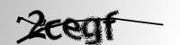
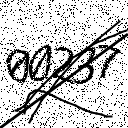
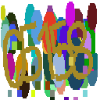

# Cortex Captcha Solving

> Сделано на основе [keras.io/examples/vision/captcha_ocr](https://keras.io/examples/vision/captcha_ocr) *([A_K_Nain](https://twitter.com/A_K_Nain))*.

Навигация:

- [Описание сегмента](#описание-сегмента)
- [Формат датасета для обучения](#формат-датасета-для-обучения)
- Использование через API
  - [Формат запроса](#формат-запроса)
  - [Формат ответа](#формат-ответа)

---

## Описание сегмента

**C**ortex **C**aptcha **S**olving *(CCS)* — Сегмент Cortex для распознавания символов на изображениях капчи.

---

## Формат датасета для обучения

Датасет для CCS имеет вид директории, содержащей изображения в формате `png` с нужным для обучения размером *(задаётся в скрипте запуска обучения для этого сегмента)*.

Примеры возможных элементов датасета:








> **Note**
>
> Подробнее об обучении см. [документацию](../../startup/startup.md#обучение-моделей).

---

## Использование через API

### Формат запроса

```json
{
  "query": "<изображение_в_виде_base64_строки>"
}
```

> **Note**
>
> Некорректные изображения будут вызывать ошибку HTTP `422` (Unprocessable Entity).

### Формат ответа

```json
{
  "response": "<распознанный_текст_капчи>"
}
```

> **Note**
>
> Если нейросети не удастся распознать символы *(такое может быть при слабообученных моделях, или неподходящем датасете)*, то строка ответа может быть пустой.

*Подробнее об использовании API см. [документацию](../../startup/api.md).*
